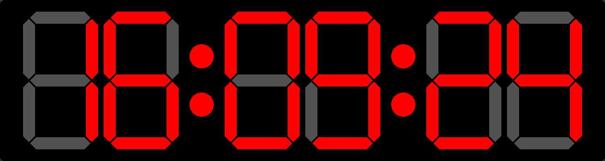

A minimalist digital clock written in C using raylib.

This project is a refactor of [Daniel Hirsch's](https://www.youtube.com/@HirschDaniel)
work in his [7-segments clock video](https://youtu.be/4GeYKi7IWDA),
focusing on better software architecture and project management practices in C.
Daniel is a god in C and I've learned a lot from his channel.
However, he codes fast due to his video format (real-time coding without editing)

This is a 7-segments digital clock writen in c to learn to use openGL and manage a proyect in c.

Compile the proyect using make (I haven't tested in windows).
